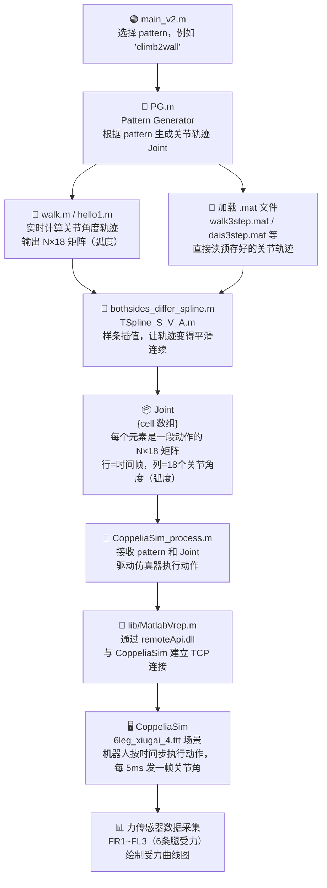

# 六足机器人仿真程序 —— 技术文档

> 本文档基于 `D:\codehub\hexapod\轨迹仿真程序` 中的源代码编写，目标是帮助你快速理解整个工程的结构和运行链条。

---

## 一、整体架构一览

整个工程分为两个顶层目录：

```
轨迹仿真程序/
├── MAIN/                      # 主控脚本 + 步态生成
│   ├── main_v2.m              # ★ 唯一入口（从这里开始读）
│   ├── PG.m                   # 轨迹生成调度器（Pattern Generator）
│   ├── CoppeliaSim_process.m  # 仿真通信与执行
│   ├── 6leg_motion/           # 各种步态的轨迹生成函数
│   │   ├── walk.m             # 基础平地行走
│   │   ├── walk3step.m        # 复杂场景（上台阶/跨坑）轨迹生成
│   │   ├── walk3step_high.m
│   │   ├── hello1.m           # 腿部伸展测试动作
│   │   ├── balance1/2.m       # 平衡控制轨迹
│   │   └── export_data/       # 预存的 .mat 关节数据文件
│   └── black_description/     # 机器人模型定义
│       ├── robot3D_description.m  # ★ 机器人几何+动力学参数
│       ├── lib_robot/             # 运动学求解函数
│       └── 动力学属性/            # 惯量、质量等 .mat 数据文件
└── lib/                       # 底层通信库
    ├── MatlabVrep.m           # ★ 封装 CoppeliaSim 远程 API 的类
    ├── remApi.m               # 官方 Remote API 接口
    ├── remoteApi.dll          # 底层通信动态链接库
    └── TSpline_S_V_A.m        # 三次样条插值核心算法
```

---

## 二、核心数据流（从头到尾跑一遍发生了什么）



---

## 三、各模块详解

### 3.1 `main_v2.m` — 总入口（最重要的文件）

这是你**唯一需要直接运行**的脚本。它做三件事：

1. **选择动作模式（pattern）**：取消注释你想执行的那行
2. **调用 `PG(pattern)`**：生成关节轨迹 `Joint`
3. **调用 `CoppeliaSim_process(pattern, Joint)`**：驱动仿真器

目前支持 6 种内置模式：

| 代号 | 动作含义 | 轨迹来源 |
|------|----------|----------|
| `'walk'` | 平地三相步态行走 | 实时调用 `walk.m` 生成 |
| `'climb2wall'` | 爬上竖直墙面 | 读取 `walk3step.mat` |
| `'climbing'` | 沿墙/台阶攀爬 | 读取 `dais3step.mat` |
| `'Legstretch'` | 腿部伸展测试 | 实时调用 `hello1.m` 生成 |

> 精简版工程已移除仅用于质心移动验证的 `commove` 与 `commove1` 模式，保留平地、爬墙/台阶、斜坡、深沟与伸腿测试相关功能。

---

### 3.2 `PG.m` — 轨迹生成调度器

> 你可以把它理解为一个"菜单路由器"：根据 `pattern` 选择对应的"菜"（轨迹生成逻辑）。

**输入：** `pattern = {'walk'}` 或 `{'climb2wall'}` 等字符串  
**输出：** `Joint`，一个 **cell 数组**，`Joint{1}` 是 `N×18` 的矩阵

关键参数：
- `step_time = 0.005` 秒 → 控制频率 200 Hz，每帧时间步长
- `period_time` → 各动作的总时长（例如 `walk` 是 2 秒，400 帧）

**多动作拼接时的平滑处理：**
当 `pattern = {'walk', 'climb2wall'}` 这样包含多个动作时，PG 会在两个动作的衔接处检查关节角度是否连续。如果不连续（差值 > 1e-5 rad），会询问是否插入样条过渡段，避免仿真中出现"跳变"。

---

### 3.3 关节数据的格式（最重要的数据结构）

```
Joint{k}  维度：N × 18
│
├── 行（N 行）：时间轴，每行 = 一个控制时间帧（5ms/帧）
└── 列（18 列）：关节轴，每列 = 一个关节的角度（单位：弧度）
               列排布方式：
               右腿1: J1, J2, J3  →  列 1,2,3
               右腿2: J1, J2, J3  →  列 4,5,6
               右腿3: J1, J2, J3  →  列 7,8,9
               左腿1: J1, J2, J3  →  列 10,11,12
               左腿2: J1, J2, J3  →  列 13,14,15
               左腿3: J1, J2, J3  →  列 16,17,18
```

每条腿有 3 个关节：
- **关节1**（髋关节，绕 Z 轴）：控制腿的左右摆动方向
- **关节2**（大腿关节，绕 Y 轴）：控制腿的前后抬起角度
- **关节3**（小腿关节，绕 Y 轴）：控制腿的弯曲程度

---

### 3.4 `6leg_motion/walk.m` — 基础行走步态

**本质：** 给出一组关键姿态点（称为 `q_mark`），再用样条插值"填满"中间的连续帧。

```
行走的核心思想（三角步态）：
- 任意时刻，6条腿分为两组：
  - 支撑组（3条腿）：保持接地，支撑机体前移
  - 摆动组（3条腿）：抬起，向前迈步

- 两组腿交替切换 → 机器人就向前走了

- 摆动相位的对角腿分组：
  相位1: 右腿1 + 左腿2 + 右腿3（或对角线）
  相位2: 左腿1 + 右腿2 + 左腿3
```

`q_mark` 矩阵的每一行是步态的一个**关键姿态帧**（角度单位：度）：
- 第一行：初始站立姿态
- 中间行：抬腿、迈步的过渡关键点
- 最后行：落脚、站立姿态

调用链：`walk.m` → `bothsides_differ_spline.m` → `TSpline_S_V_A.m`

---

### 3.5 `6leg_motion/walk3step.m` — 复杂场景轨迹离线生成

这个脚本**不是在线调用的**，而是一个**离线预生成工具**：

1. 定义足端期望轨迹（X/Y/Z 各腿在时间轴上的位置）
2. 用 `makima` 样条插值做连续化
3. 调用 `robot3D_description` 获取机器人模型
4. 对每一帧调用 `ik_collision`（逆运动学 + 碰撞检测），求解 18 个关节角度
5. 保存为 `export_data/walk3step.mat`

> 💡 **为什么要离线预生成？** 逆运动学求解比较耗时，提前算好保存，主程序运行时直接加载，效率更高。

它支持的场景包括：
- **平地行走**：标准三角步态，6 腿交替摆动
- **上高台**：检测到足端 X 超过台阶阈值时，提高机体 Z 坐标，抬高足端
- **跨坑**：分 7 个阶段调整步长，让每条腿能准确落在坑的对侧

---

### 3.6 `black_description/robot3D_description.m` — 机器人模型

这个函数构建了整个机器人的**刚体运动学树**，包含：

| 数据 | 来源文件 | 内容 |
|------|----------|------|
| 关节位置 | `under_joint_position.mat` | 各关节相对父连杆的位移 `b` |
| 质心位置 | `com.mat` | 每个连杆的质心坐标 |
| 惯量矩阵 | `Inertia.mat` | 每个连杆的 3×3 惯量张量 |
| 质量 | `mass.mat` | 每个连杆的质量（kg） |

机器人共 **19 个刚体节点**（1 个机体 + 6×3 个关节连杆），形成父-子树状拓扑：
```
body(1)
├── Rleg1_joint1(2) → joint2(3) → joint3(4)
├── Rleg2_joint1(5) → joint2(6) → joint3(7)
├── Rleg3_joint1(8) → joint2(9) → joint3(10)
├── Lleg1_joint1(11) → joint2(12) → joint3(13)
├── Lleg2_joint1(14) → joint2(15) → joint3(16)
└── Lleg3_joint1(17) → joint2(18) → joint3(19)
```

关节角度限位（默认）：
- 关节1（髋关节）：-80° ~ +80°
- 关节2（大腿）：-90° ~ +90°
- 关节3（小腿）：-120° ~ 0°

---

### 3.7 `CoppeliaSim_process.m` — 与仿真器通信

> 这是 MATLAB 和 CoppeliaSim 之间的"翻译官"。

**初始化阶段：**
1. 创建 `MatlabVrep` 对象：`vrobot = MatlabVrep(Control_T)`（`Control_T=5ms`）
2. 初始化连接：`vrobot.init()`（通过 `remoteApi.dll` 建立 TCP 连接）
3. 根据 `pattern` 设置机器人的初始位置和姿态（欧拉角）

**执行阶段（核心循环）：**
```matlab
for 每个动作 jj
    vrobot.go();          % 启动仿真
    for 每一帧 kk
        vrobot.Joint = Joint{jj}(kk,:);  % 取当前帧的18个关节角
        vrobot.set_joint();               % 发送给 CoppeliaSim
        vrobot.trigger();                 % 触发仿真步进（前进5ms）
        [F, tao] = vrobot.get_force_sensor();  % 读回6个力传感器数据
    end
end
```

**仿真结束：**
- 调用 `vrobot.pause()` + `vrobot.stop()` 停止仿真
- 绘制 6 条腿的末端受力曲线（两个 figure 窗口）

---

### 3.8 `lib/MatlabVrep.m` — CoppeliaSim 远程 API 封装

这是对官方 `remApi.m`（CoppeliaSim Remote API）的面向对象封装，提供如下方法：

| 方法 | 功能 |
|------|------|
| `init()` | 初始化连接，获取关节/传感器句柄 |
| `go()` | 启动同步仿真 |
| `trigger()` | 触发一个仿真步骤（5ms） |
| `set_joint()` | 将关节角度写入仿真器 |
| `set_body_p(pos)` | 设置机体位置 |
| `set_body_o(euler)` | 设置机体姿态（欧拉角） |
| `get_force_sensor()` | 读取6个脚部力传感器数据 |
| `pause()` / `stop()` | 暂停/停止仿真 |

---

### 3.9 `lib/TSpline_S_V_A.m` — 三次样条插值

这是轨迹平滑的核心数学工具，给定：
- 起点 `(p0, v0, a0)`：位置、速度、加速度
- 中间点 `p1`（时刻 `t1`）
- 终点 `(p2, v2, a2)`

求解出**分段四次多项式**，保证位置、速度、加速度的连续性，让关节运动不突兀。

---

## 四、快速上手流程

### Step 1：准备工作
1. 安装并打开 **CoppeliaSim**（原 V-REP）
2. 在 CoppeliaSim 中打开场景文件 `6leg_xiugai_4.ttt`
3. **不要点"播放"**，等待 MATLAB 连接

### Step 2：配置 MATLAB 路径
```matlab
% 在 MATLAB 中执行：
cd('D:\codehub\hexapod\轨迹仿真程序\MAIN')
addpath(genpath('..\lib'))   % 添加底层库路径
addpath(genpath('.\black_description'))  % 添加机器人模型路径
addpath(genpath('.\6leg_motion'))        % 添加步态函数路径
```

### Step 3：运行仿真
打开 `main_v2.m`，选择一个 pattern（推荐从 `'walk'` 开始）：
```matlab
pattern = { 'walk' };   % 取消注释这一行，注释其他 pattern 行
```
然后直接 **Run**（F5）。

### Step 4：观察结果
- CoppeliaSim 窗口中机器人会开始运动
- MATLAB 命令窗口会显示执行进度
- 仿真结束后，MATLAB 会自动弹出**6条腿受力曲线图**

---

## 五、新增一个动作——扩展流程

如果你想添加自己的步态或动作，按以下步骤：

```
Step 1: 在 6leg_motion/ 下新建 my_gait.m
        → 定义关键姿态点 q_mark（N×18，单位：度）
        → 调用 bothsides_differ_spline(q_mark, period_time, step_time)/180*pi
        → 返回 Joint 矩阵

Step 2: 在 PG.m 的 switch 中添加：
        case 'my_gait'
            period_time = 2;
            Joint{ii} = my_gait(period_time, step_time);

Step 3: 在 CoppeliaSim_process.m 的 switch 中添加：
        case 'my_gait'
            position = [0; 0; 1.0];          % 机器人初始位置
            vrobot.set_body_p(position);
            eulerAngles = [0; 0; 0] / rad2deg; % 机器人初始姿态
            vrobot.set_body_o(eulerAngles);

Step 4: 在 main_v2.m 中取消注释：
        pattern = { 'my_gait' };
```

---

## 六、常见问题排查

| 现象 | 可能原因 | 解决方法 |
|------|----------|----------|
| MATLAB 报错"找不到 remApi" | lib 路径没有添加 | `addpath('..\lib')` |
| 连接 CoppeliaSim 失败 | 场景未打开 / 端口错误 | 先打开场景，检查 API 端口（默认19997） |
| 机器人动作很卡顿 | 仿真步长不匹配 | 确认 CoppeliaSim 步长设为 5ms |
| 关节角超限报错 | 轨迹点超过关节限位 | 检查 `q_mark` 中的角度值是否在 ±80°/±90°/0°~-120° 范围内 |
| 动作切换时机器人"跳一下" | 两个动作的衔接不连续 | PG 会询问是否插值过渡，选 Y |
| `.mat` 文件找不到 | 当前目录不对 | `cd` 到 `MAIN/` 目录再运行 |

---

## 七、文件关系速查表

| 文件 | 角色 | 被谁调用 |
|------|------|---------|
| `main_v2.m` | **唯一入口** | 手动运行 |
| `PG.m` | 轨迹调度器 | `main_v2.m` |
| `walk.m` | 平地步态生成 | `PG.m` |
| `walk3step.m` | 复杂轨迹预生成（离线工具） | 手动运行后保存 .mat |
| `hello1.m` | 腿部伸展测试 | `PG.m` |
| `bothsides_differ_spline.m` | 样条插值驱动程序 | `walk.m` 等 |
| `TSpline_S_V_A.m` | 三次样条核心算法 | `bothsides_differ_spline.m` |
| `robot3D_description.m` | 机器人模型定义 | `PG.m`, `walk3step.m` |
| `CoppeliaSim_process.m` | 仿真通信执行器 | `main_v2.m` |
| `MatlabVrep.m` | CoppeliaSim API 封装类 | `CoppeliaSim_process.m` |
| `remApi.m` / `remoteApi.dll` | 官方底层通信库 | `MatlabVrep.m` |
